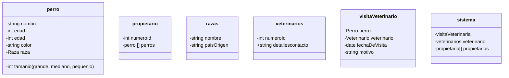

## Ejercicio


## Ejercicio 1

```
classDiagram
   class Libro {
      -string titulo
      -string autor
      -string genero
      -int ID
   }
   
   class Usuario {
      -string nombre
      -int ID
   }
   
   class Prestamo {
      -date fechaiInicio
      -date fechaDevolver
      -string estado
      -Usuario usando
      -Libro libro
   }   
   
   class Sistema {
      -Libro [] catalogo
      -Prestamo [] prestamos
   }
   
   Prestamo --> Usuario : hace
   Sistema --> Prestamo : visualizar
   
```

## Ejercicio 2

```
classDiagram {
    class Pedido {
        -int numeroPedido
        +string estado
        +Cliente cliente
        +list platos
    }
    
    class Plato {
        +string nombre
        +float precio
    }
    
    class Cliente {
        +string nombre
        +string telefono
    }
    
    Pedido --> Cliente : pertenece a
    Plato o-- Pedido : contiene
}

```

## Ejercicio 3

```
classDiagram {
    class Usuario {
        -string nombre
        -string correo
        -string crearRepo
        -string modificarArchivos
        -string guardarCambios
        -string verHistorial
        -string revertirCambios
    }
    
    class Desarrollador {
        -string modificarArchivos
        -string guardarCambiosConCommit
    }

    class Commit {
        -string identificador
        -string mensaje
        -string fechaDeGuardado
        -string fechaDeRealizacion
    }
}

```